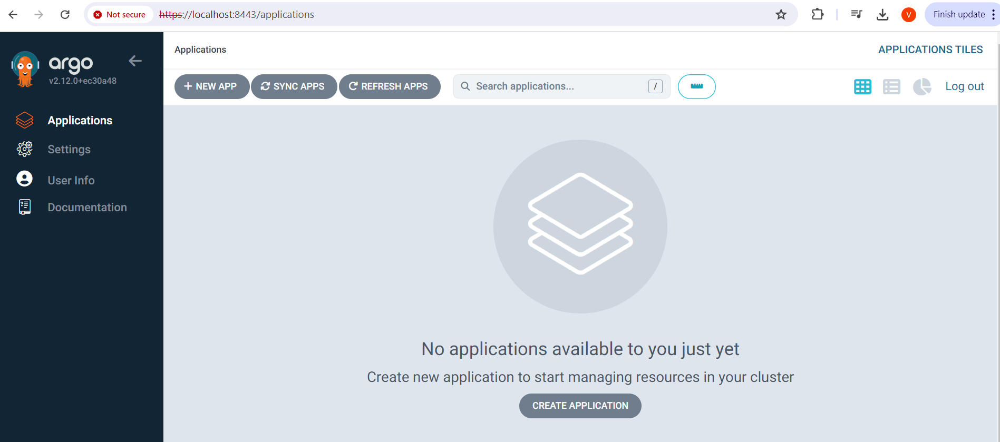

# Доступ до локального argocd
Менеджмент інтерфейс ardocd встановлюється за замовченням у вигляді веб-сервісу, для доступа необхідно:
1. Отримати пароль admin для argocd із kubernetes secret
2. Виконати порт-форвардінг для доступу до веб-сервісу
3. Залогінитись за допомогою веб-браузера або консольної утиліти argocd (ім'я користувача admin)

Демо з прикладом: 

Консоль argocd: 
