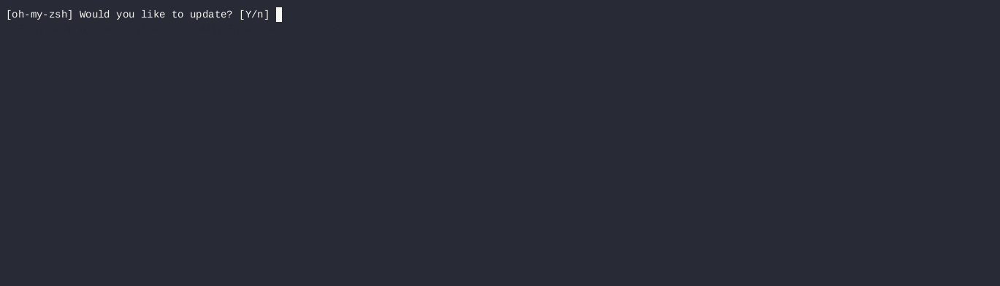

# Kubectl Plugin: Resource Usage

This script is a custom `kubectl` plugin designed to format and display the current CPU and memory usage of pods (no suppor for nodes in current version) within a specified Kubernetes namespace. The output includes the resource type, namespace, pod name, CPU usage, and memory usage.

## Prerequisites

Before using this script, ensure the following prerequisites are met:

1. **kubectl**: The Kubernetes command-line tool must be installed and configured to interact with your Kubernetes cluster.
2. **Metrics Server**: The Kubernetes Metrics Server must be installed and running in your cluster. This is required for the `kubectl top` command to retrieve current resource usage metrics.

   To install the Metrics Server, run:
   ```sh
   kubectl apply -f https://github.com/kubernetes-sigs/metrics-server/releases/latest/download/components.yaml

# Installation
 - Get script kubeplugin and save it as kubectl-ptop
 - Make it executable
 - Move to a directory in your $PATH, such as /usr/local/bin/ to use as kubenetes plugin
```
chmod +x kubectl-ptop
sudo mv kubectl-ptop /usr/local/bin/
```
# Usage
Script can be invoked as a kubectl plugin:
```
kubectl ptop [namespace]
```
## Parameters
- namespace: (optional) The namespace to filter pods. If no namespace is provided, the script defaults to the kube-system namespace.
## Examples
Get resource usage for pods in the kube-system namespace (default behavior) or specific namespace:
- Recorded session:


- Text output:
```
Resource, Namespace, Name CPU, Memory
Pod, kube-system, coredns-576bfc4dc7-2l4k8, 5m, 29Mi
Pod, kube-system, local-path-provisioner-6795b5f9d8-6wgxq, 1m, 16Mi
Pod, kube-system, metrics-server-557ff575fb-j2x2v, 11m, 40Mi
Pod, kube-system, svclb-traefik-f98703dc-98gx8, 0m, 0Mi
Pod, kube-system, traefik-5fb479b77-fwfv8, 1m, 39Mi
```

# Additional Notes:

- The script is designed to work as a `kubectl` plugin, allowing it to be called using the `kubectl` command followed by the plugin name.
- The `kubectl top` command relies on the Metrics Server to provide real-time resource usage data for pods.
- The `README.md` file provides a clear overview of how to install, use, and troubleshoot the script.
